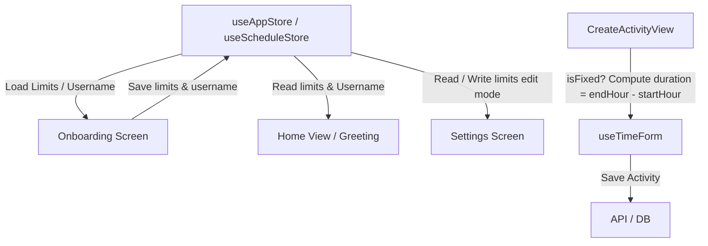

# Technical Design: Settings and Onboarding Fixes

## Technical Approach
Implement robust state binding for username persistence, split the activity creation flow into a 6-step wizard, introduce conditional duration and end-time pickers, refine settings read/edit modes with correct crossover hour validations, and provide a toggleable chronological list view on the Schedule screen.

## Architecture Decisions
- **Persistent App State**: Store the username in `useAppStore` with AsyncStorage backing to allow dynamic greeting rendering in `HomeView`.
- **Stepped Wizard Routing**: Manage step progression (1 to 6) dynamically in `CreateActivityView` and pass sub-form props down.
- **Conditional Forms**: Partition inputs conditionally on `isFixed` state rather than maintaining separate fixed-specific components.
- **Swipe Dismissal**: Integrate a simple `PanResponder` hook inside overlay modals (`ActivityDetailModal`) to allow vertical swipe-down dismissal.

## Data Flow


## File Changes
| Action | File | Description |
| :--- | :--- | :--- |
| Modify | `src/infrastructure/store/useAppStore.ts` | Add `username` and `setUsername` to the onboarding state. |
| Modify | `src/presentation/components/organisms/Onboarding/OnboardingVIew.tsx` | Add username input, replace Argentinian Spanish, fix crossover validation (`===`). |
| Modify | `src/presentation/screens/Settings/SettingsView.tsx` | Add read/edit modes, confirm alert, reset on cancel, validate crossover limits (`===`). |
| Modify | `src/infrastructure/store/useScheduleStore.ts` | Change crossover reset logic on load to only trigger on `===`. |
| Modify | `src/presentation/hooks/useTimeForm.ts` | Compute duration for fixed activities (`endHour - startHour`), default `isFixed` for tasks, locks. |
| Create | `src/presentation/components/organisms/CreateActivity/NameIdentityStep.tsx` | Wizard Step 1 for Name & Identity with dynamic icons. |
| Create | `src/presentation/components/organisms/CreateActivity/TypeDifficultyStep.tsx` | Wizard Step 2 for Type & Difficulty. |
| Delete | `src/presentation/components/organisms/CreateActivity/NameTypeStep.tsx` | Split into Step 1 and Step 2. |
| Modify | `src/presentation/components/organisms/CreateActivity/PriorityDeadlineStep.tsx` | Disable/lock priority selection to "alta" if activity is fixed. |
| Modify | `src/presentation/components/organisms/CreateActivity/TimeConfigStep.tsx` | Remove the `dayBadge` element from header. |
| Modify | `src/presentation/components/molecules/CreateActivity/TimePartitionForm.tsx` | Render conditional `endHour` picker, hide duration for fixed. |
| Modify | `src/presentation/screens/Activity/activityCreation/CreateActivityView.tsx` | Implement 6-step wizard state, save loading overlay. |
| Modify | `src/presentation/screens/Home/HomeView.tsx` | Dynamically display user greeting, Neutral Spanish in alert. |
| Modify | `src/presentation/components/organisms/Schedule/ActivityDetailModal.tsx` | Add `PanResponder` drag/swipe-down dismissal gesture. |
| Modify | `src/presentation/screens/Schedule/ScheduleView.tsx` | Add view toggle state, render chronological list / grid, height constraints. |
| Modify | `src/presentation/components/organisms/Schedule/ScheduleHeader.tsx` | Add toggle button control next to refresh. |

## Interfaces / Contracts
- `useAppStore`:
  ```typescript
  interface OnboardingState {
    hasSeenOnboarding: boolean;
    username: string;
    setHasSeenOnboarding: (value: boolean) => void;
    setUsername: (name: string) => void;
  }
  ```
- `useTimeForm` export addition:
  ```typescript
  setEndTime: (val: Date | ((prev: Date) => Date)) => void;
  ```

## Testing Strategy
- **Unit Tests**:
  - Store bounds validation: verify `loadDayLimits` does not reset crossover hours (e.g., 22:00 -> 06:00).
  - Validation rules: verify settings bounds reject only equal hours.
- **Component Tests**:
  - Onboarding name validation: check that button is blocked if name is empty or whitespaces.
  - Wizard steps count: check correct progression.

## Migration / Rollout
- Revert via standard Git branching and commits. Local storage changes (schema additions) are backwards-compatible (nullable username).

## Open Questions
- None.
